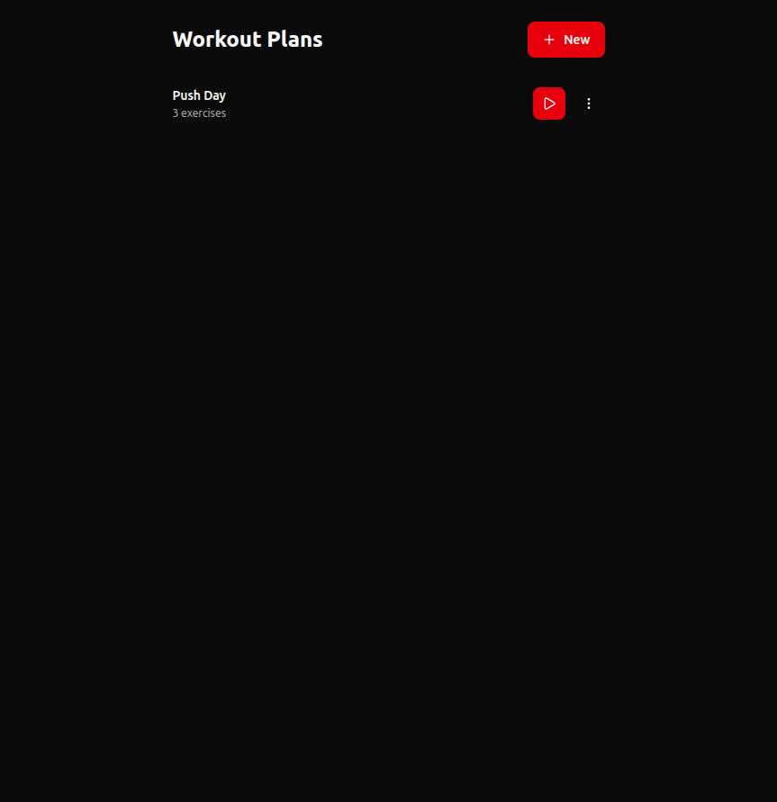
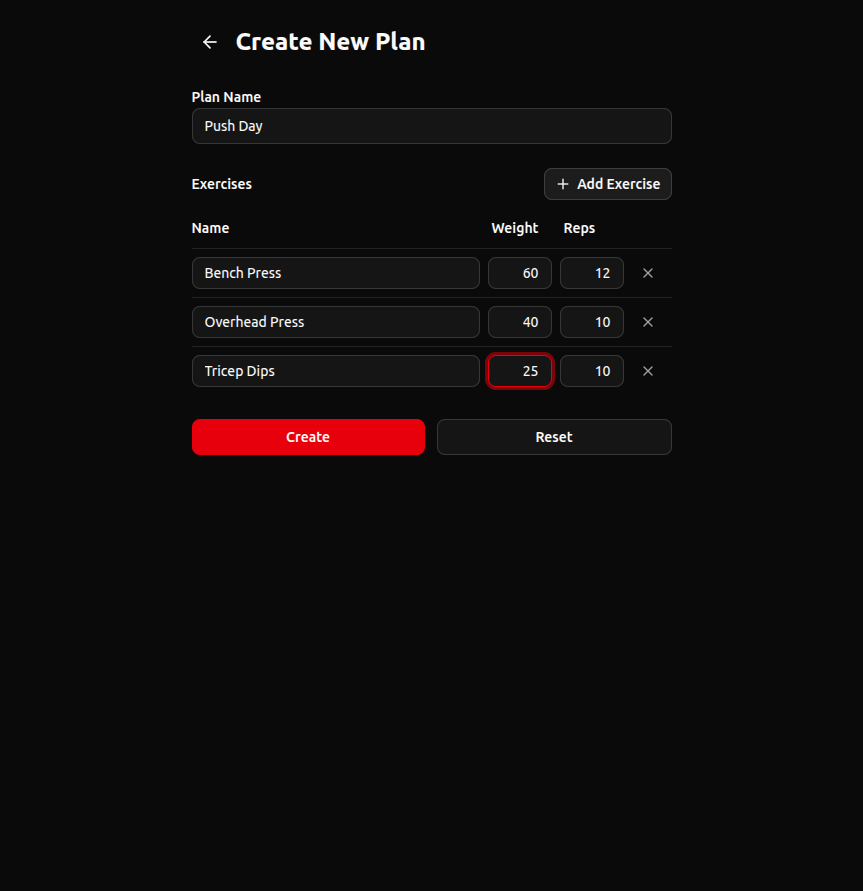
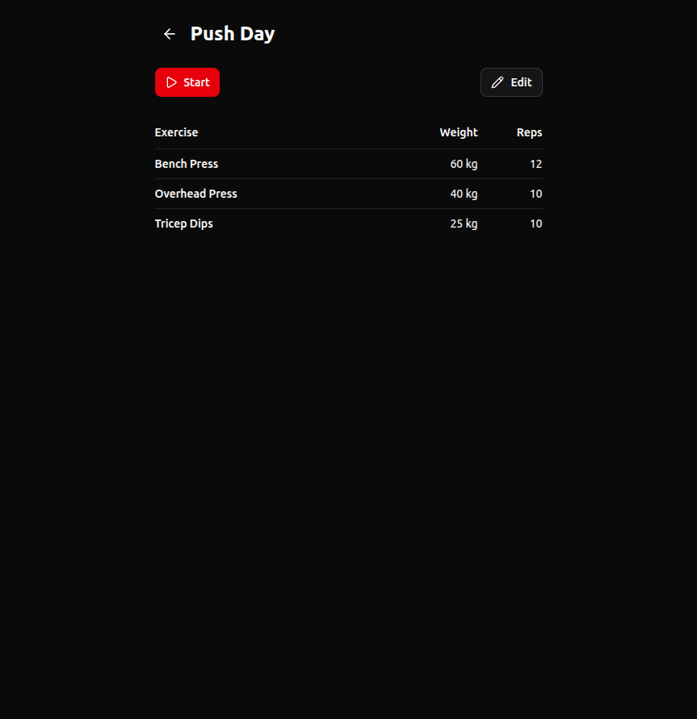
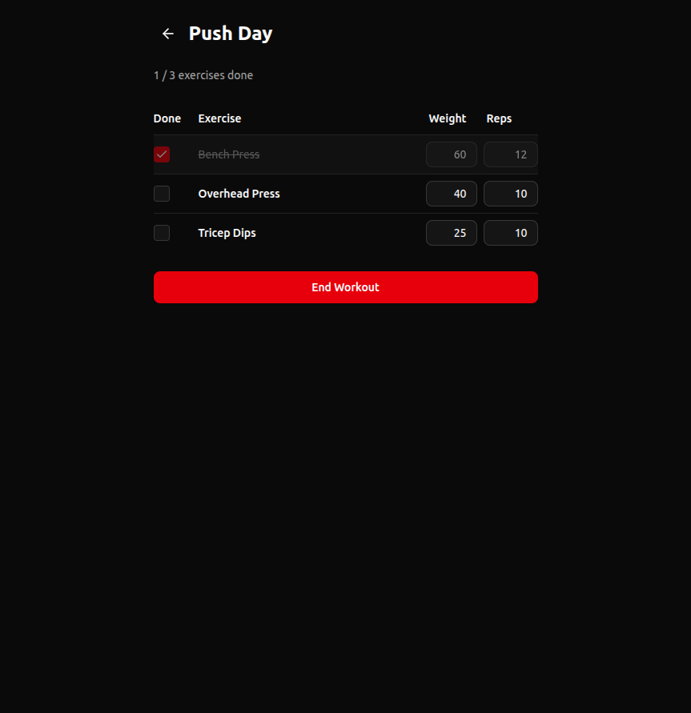

# Workout App

A sleek, mobile-first workout plan manager and tracker built with Next.js. Create custom workout plans, track exercises in real-time, and celebrate when you finish.

**[Live Demo](https://workout-app-wine-psi.vercel.app/)**

## Screenshots

<div align="center">
<table>
<tr>
<td align="center"><strong>Plan List</strong></td>
<td align="center"><strong>Create Plan</strong></td>
</tr>
<tr>
<td></td>
<td></td>
</tr>
<tr>
<td align="center"><strong>Plan Detail</strong></td>
<td align="center"><strong>Workout Tracking</strong></td>
</tr>
<tr>
<td></td>
<td></td>
</tr>
</table>
</div>

## Features

- **Create & manage workout plans** -- name your plan and add exercises with weight and reps
- **Real-time workout tracking** -- check off exercises as you go with a live progress counter
- **Adjust on the fly** -- modify weight and reps mid-workout
- **Confetti celebration** -- canvas confetti fires when you complete all exercises
- **Edit & delete plans** -- full CRUD with confirmation dialogs
- **Offline-capable** -- all data persisted in localStorage, no account required
- **Dark theme** -- gym-friendly dark UI with red accents
- **Mobile-first** -- touch-friendly buttons and responsive layout

## Tech Stack

| Layer | Technology |
|-------|-----------|
| Framework | [Next.js 16](https://nextjs.org) (App Router) |
| UI | [React 19](https://react.dev), [Tailwind CSS v4](https://tailwindcss.com), [shadcn/ui](https://ui.shadcn.com) |
| Forms | [React Hook Form](https://react-hook-form.com) + [Zod](https://zod.dev) |
| Icons | [Lucide React](https://lucide.dev) |
| Effects | [canvas-confetti](https://github.com/catdad/canvas-confetti) |
| Storage | localStorage (via custom reactive hooks) |
| Testing | [Playwright](https://playwright.dev) (E2E) |
| Language | TypeScript |

## Getting Started

### Prerequisites

- Node.js 18+
- npm

### Install & Run

```bash
git clone https://github.com/<your-username>/workout-app.git
cd workout-app
npm install
npm run dev
```

Open [http://localhost:3000](http://localhost:3000) in your browser.

### Available Scripts

| Command | Description |
|---------|-------------|
| `npm run dev` | Start development server |
| `npm run build` | Production build |
| `npm run start` | Start production server |
| `npm run lint` | Run ESLint |
| `npm run test:e2e` | Run Playwright E2E tests |

## Project Structure

```
app/
  page.tsx                    # Home -- plan list
  plan/
    create/page.tsx           # Create new plan
    [id]/page.tsx             # Plan detail view
    [id]/edit/page.tsx        # Edit existing plan
    [id]/workout/page.tsx     # Workout tracking session
components/
  plan-form.tsx               # Reusable create/edit form
  plan-list-table.tsx         # Plan list with actions
  exercise-table.tsx          # Read-only exercise table
  ui/                         # shadcn/ui primitives
lib/
  types.ts                    # Zod schemas (Exercise, WorkoutPlan)
  storage.ts                  # localStorage service
  use-local-storage-plans.ts  # Reactive storage hooks
  utils.ts                    # Utility functions
e2e/                          # Playwright E2E tests
```

## Testing

The project includes comprehensive Playwright E2E tests covering every core user flow:

- Plan creation, viewing, editing, and deletion
- Workout tracking: checking exercises, modifying values, confetti trigger
- Edge cases: empty states, confirmation dialogs, exercise reset

```bash
# Run all E2E tests (auto-starts dev server)
npm run test:e2e
```

## Deployment

Deployed on [Vercel](https://vercel.com). Push to `main` to trigger a new deployment.

## License

MIT
